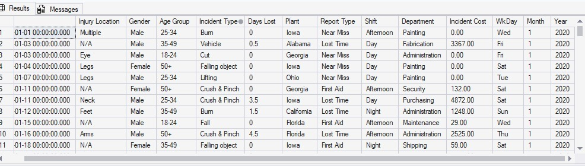
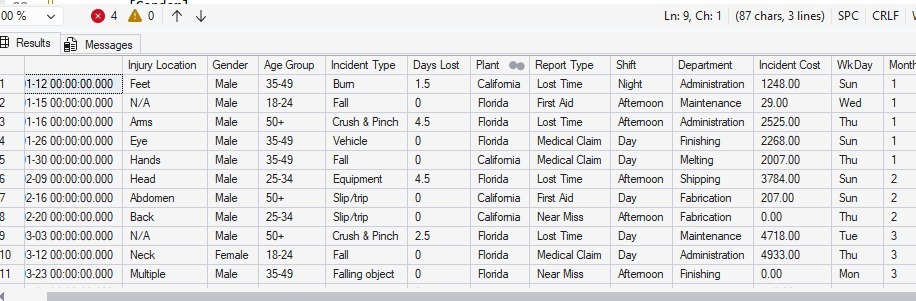
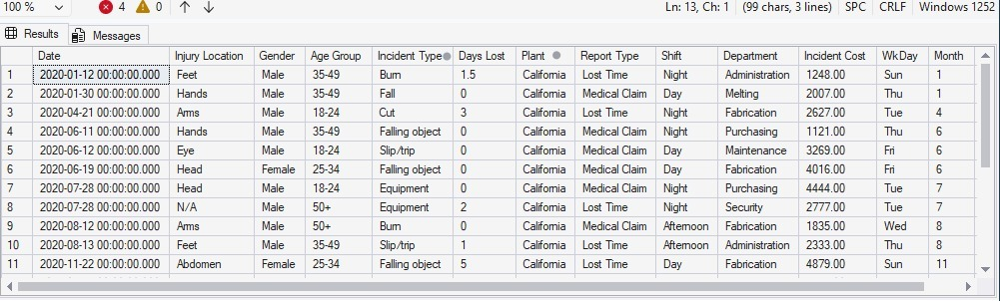
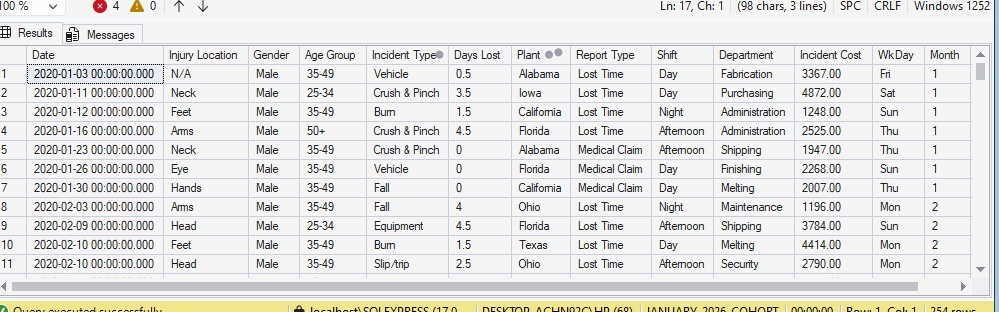
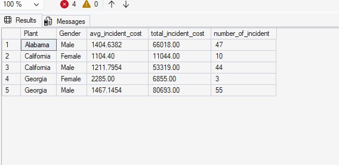
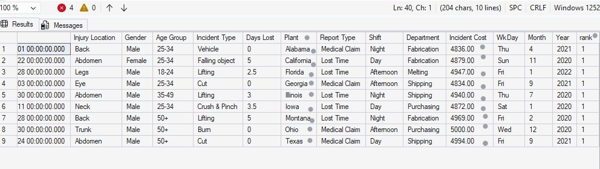

**PROJECT 3**
# SQL-PROJECT
# TITLE: Workplace Safety Incident Analysis using SQL
**SQL CODES**[sales data](https://github.com/justvictorav/justvictorav.github.io/blob/main/codes.sql)

 **Skill Used**:Data Retrieval (SELECT): Queried and extracted specific information from the database.
Data Aggregation (SUM, COUNT): Calculated totals, such as sales and quantities, and counted records to analyze data trends.
Data Filtering (WHERE, BETWEEN, IN, AND): Applied filters to select relevant data, including filtering by ranges and lists.

## Business Context
A manufacturing company is experiencing increasing workplace incident costs across multiple plant locations.  
 

The operations team has requested a data analysis to:
- Identify high-risk locations  
- Understand cost drivers  
- Highlight severe incidents  
- Support safety improvement decisions  

---

## Dataset  
Workplace Safety Data  

Key fields include:

- Date  
- Injury Location  
- Gender  
- Age Group  
- Incident Type  
- Days Lost  
- Plant  
- Report Type  
- Shift  
- Department  
- Incident Cost  
- WkDay  
- Month  
- Year

---

## SQL Questions and SQL Solutions

### 1. Identify all incidents that occurred in the Georgia plant
```sql
SELECT *
FROM [dbo].['Workplace Safety Data$']
WHERE PLANT='GEORGIA'
```
## 🖼️Preview

---

### 2. Retrieve incidents that are not classified as FALL-related
```sql
SELECT *
FROM [dbo].['Workplace Safety Data$']
WHERE [INCIDENT TYPE] <> 'fall'
```
## 🖼️Preview



---

### 3. Analyze incidents in key operational locations (California and Florida)
```sql
SELECT *
FROM[dbo].['Workplace Safety Data$']
WHERE PLANT IN ('CALIFORNIA','FLORIDA')
```
## 🖼️Preview


---

### 4. Identify high-cost incidents in California (cost greater than 1000)
```sql
SELECT *
FROM[dbo].['Workplace Safety Data$']
WHERE PLANT = 'CALIFORNIA' AND [INCIDENT COST]>1000
```
## 🖼️Preview


---

### 5. Identify incidents based on either location(CALIFORNIA) or cost condition(>1000)
```sql
SELECT *
FROM[dbo].['Workplace Safety Data$']
WHERE PLANT = 'CALIFORNIA' OR [INCIDENT COST]>1000
```
## 🖼️Preview

---

### 6. Calculate average, total, and count of incident costs by plant and gender in the following plants (ALABAMA CALIFORNIA GEORGIA)
```sql
select [Plant]
  ,[Gender]
  ,avg([Incident Cost]) as avg_incident_cost
  ,sum([Incident Cost]) as total_incident_cost
  ,count(*) as number_of_incident
  from[dbo].['Workplace Safety Data$']
  group by [Plant]
          ,[Gender]
  having plant in ('alabama','california','georgia')
 order by[Plant] asc
```
## 🖼️Preview

---

### 7. Identify the highest-cost incident in each plant
```sql
with incident_rank as
(
select * 
       ,rank () over( partition by[Plant] order by [Incident Cost] desc) as rank
from[dbo].['Workplace Safety Data$']
)

select*
from incident_rank
where rank=1 
```
## 🖼️Preview

---

## Key Insights
- Some plants generate significantly higher incident costs than others  
- High-cost incidents are concentrated in specific locations  
- Gender-based patterns exist in incident distribution  
- Categorizing incidents helps prioritize safety improvements  

---

## Tools Used
- SQL Server  
- Excel (data preparation)

---

## Conclusion

This project demonstrates the use of SQL to analyze workplace safety data and extract meaningful business insights. By applying filtering, aggregation, window functions, and conditional logic, key patterns in incident occurrence and cost distribution were identified.

The analysis highlights that incident costs vary significantly across plants and demographic groups, with certain locations consistently showing higher risk levels. High-cost incidents were successfully isolated and ranked, providing visibility into the most critical safety concerns.

Overall, this project shows how SQL can be used not just for querying data, but for supporting data-driven decision-making. The insights generated can help organizations prioritize safety improvements, reduce incident costs, and enhance operational efficiency.
