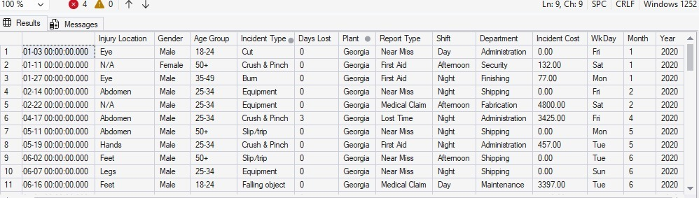

# SQL-PROJECTS
# Workplace Safety Incident Analysis using SQL

## Business Context
A manufacturing company is experiencing increasing workplace incident costs across multiple plant locations.  

The operations team has requested a data analysis to:
- Identify high-risk locations  
- Understand cost drivers  
- Highlight severe incidents  
- Support safety improvement decisions  

---

## Dataset
Workplace Safety Data  

Key fields include:
- Plant  
- Incident Type  
- Incident Cost  
- Gender  
- Department  
- Date  

---

## SQL Questions and SQL Solutions

### 1. Identify all incidents that occurred in the Georgia plant
```sql
SELECT *
FROM [dbo].['Workplace Safety Data$']
WHERE PLANT='GEORGIA'
```
## 🖼️Preview

---

### 2. Retrieve incidents that are not classified as FALL-related
```sql
SELECT *
FROM [dbo].['Workplace Safety Data$']
WHERE [INCIDENT TYPE] <> 'fall'
```
## 🖼️Preview


---

### 3. Analyze incidents in key operational locations (California and Florida)
```sql
SELECT *
FROM[dbo].['Workplace Safety Data$']
WHERE PLANT IN ('CALIFORNIA','FLORIDA')
``` 

---

### 4. Identify high-cost incidents in California (cost greater than 1000)
```sql
SELECT *
FROM[dbo].['Workplace Safety Data$']
WHERE PLANT = 'CALIFORNIA' AND [INCIDENT COST]>1000
``` 

---

### 5. Identify incidents based on either location(CALIFORNIA) or cost condition(>1000)
```sql
SELECT *
FROM[dbo].['Workplace Safety Data$']
WHERE PLANT = 'CALIFORNIA' OR [INCIDENT COST]>1000
``` 
---

### 6. Calculate average, total, and count of incident costs by plant and gender in the following plants (ALABAMA CALIFORNIA GEORGIA)
```sql
select [Plant]
  ,[Gender]
  ,avg([Incident Cost]) as avg_incident_cost
  ,sum([Incident Cost]) as total_incident_cost
  ,count(*) as number_of_incident
  from[dbo].['Workplace Safety Data$']
  group by [Plant]
          ,[Gender]
  having plant in ('alabama','california','georgia')
 order by[Plant] asc
```
---

### 7. Identify the highest-cost incident in each plant
```sql
with incident_rank as
(
select * 
       ,rank () over( partition by[Plant] order by [Incident Cost] desc) as rank
from[dbo].['Workplace Safety Data$']
)

select*
from incident_rank
where rank=1 
```
---

## Key Insights
- Some plants generate significantly higher incident costs than others  
- High-cost incidents are concentrated in specific locations  
- Gender-based patterns exist in incident distribution  
- Categorizing incidents helps prioritize safety improvements  

---

## Tools Used
- SQL Server  
- Excel (data preparation)

---

## Project Structure
sql-workplace-safety-analysis/
│
├── queries/
│   └── safety_analysis.sql
│
├── outputs/
│   └── screenshots.png
│
└── README.md
